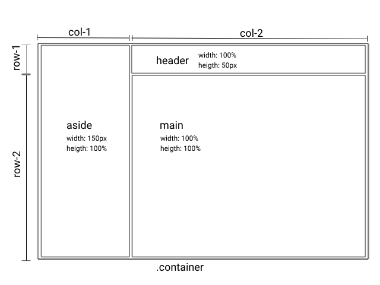

# Deskboard - Sales Management Dashboard

## Objetivo 

Criar o ccs para o seguinte layout retirado do [dribbble.com](https://dribbble.com/shots/19585242/attachments/14709527?mode=media) com pesquisa no [pinterest](https://in.pinterest.com/pin/202591683232196615/), utilizando técnicas do GridLayout

> **créditos do design**:
Sales Management Dashboard - Deskboard designed by Ali Husni ✨ for Pickolab Studio. Connect with them on Dribbble; the global community for designers and creative professionals.

## Montando o container base

### 1. Definimos a arquivo reset.css

~~~css
* {
    padding: 0;
    margin: 0;
    border: 0;
}

html, body {
    width: 100%;
    height: 100%;
}
~~~

### 2. Criamos a estrutura base no arquivo container-base.css
Nesse css, definimos a estrutura que determina a posição das tags: **header, aside,  main**

**imagem da estrutura base do bashboard**

**css base**
~~~css
.container {
    display: grid;
    align-content: stretch;

    width: 100%;
    height: 100%;

    grid-template-columns: 150px auto;
    grid-template-rows: 50px auto;

}

header{
    background-color: gray;
    color: white;
    grid-column: 2;
    grid-row: 1 ;
    
}

aside{
    background-color: black;
    color: white;
    grid-column: 1;
    grid-row: 1 / span 2; 
}

main{
    background-color: azure;
    grid-column: 2;
}
~~~

**html base**
~~~html
    

        <header>
            <pan>Header - header principal
        </header>

        <aside>
            Aside - menu lateral
        </aside>

        <main>
            <pan>Main - área principal
        </main>
    

~~~

## Referências de estudos CSS

* https://css-tricks.com/snippets/css/complete-guide-grid/